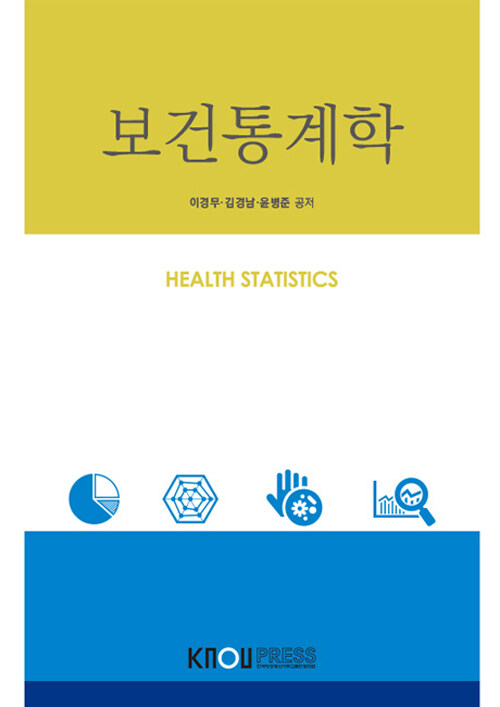

# 보건통계학 (Health Statistics)

`Data Analysis` `R` `ggplot2`

## 개요

이 저장소는 **보건통계학** 학습 내용을 정리하고 있습니다.

> 이경무·김경남·윤병준

## 학습 목표
- 

## 학습 내용

실습 관련 챕터는 제11장뿐이므로, 11장만 기술함

| 챕터 | 챕터명 | 핵심 학습 내용 |
|------|--------|----------|
|11|[보건 및 환경 자료 분석의 실제]()|· 시계열분석 · 생존분석 · 공간분석 · 메타분석|
